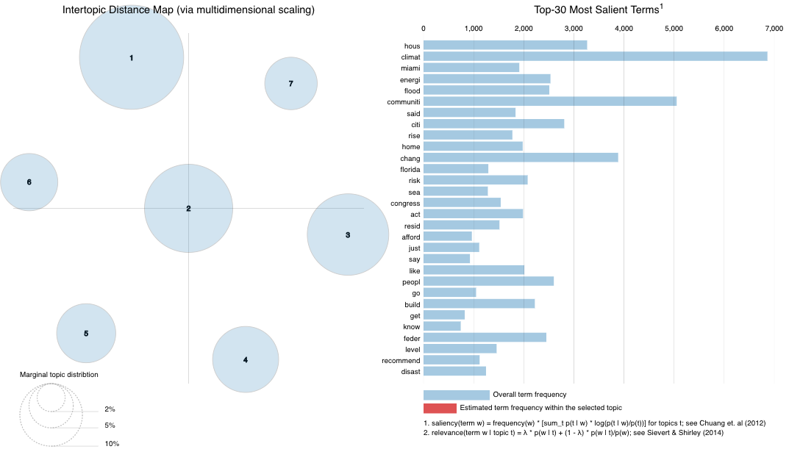

```{r setup, include=FALSE}
knitr::opts_chunk$set(echo = TRUE)

# attached packages
library(tidyr) #text analysis in R
library(lubridate) # working with date data
library(tidyverse)
library(tidytext)
library(here)
library(LexisNexisTools) # Nexis Uni data wrangling
library(sentimentr)
library(readr)
library(quanteda)
library(quanteda.textstats)
library(quanteda.textplots)
#library(readtext) # quanteda subpackage for reading pdf
library(tm)
#library(topicmodels)
#library(ldatuning)
library(reshape2)
library(ggplot2)
library(forcats)
library(stringr)
library(widyr)# pairwise correlations
library(igraph) # network plots
library(ggraph)
library(patchwork)
library(wordcloud) # visualization of common words in the data set
library(rtweet) # load twitter library - the rtweet library is recommended now over twitteR
library(textdata) # load nrc sentiment lexicon
```

# Sentiment & Temporal Plan

- look at all nrc emotions 
- dial down into one or two emotions 
- temporal sentiments: specific emotions and neg/pos/neutral


- plot frequencies of both to compare social media frequency vs academic/published journal frequency 

- word relationship using geom_node and geom_edge ("scary plots")
- correlations
- hashtag word cloud

# Setup Data

### Setup stop words and Bing/NRC sentiments
```{r}
#read in stop words data
data(stop_words)
```

## Read in Nexis Uni Data
```{r}
# read in nexis uni data 
my_files <- list.files(pattern = ".docx", path = here("data"),
                      full.names = TRUE, recursive = TRUE, ignore.case = TRUE)

cg_nex_data <- lnt_read(my_files) # object of class 'LNT output'


cg_nex_meta_df <- cg_nex_data@meta
cg_nex_articles_df <- cg_nex_data@articles
cg_nex_paragraphs_df <- cg_nex_data@paragraphs
```

## Cleaning Nexis Uni Data
```{r nexis_data cloud seeding cleaning, message=FALSE}
cg_nex_dat2<- data_frame(element_id = seq(1:length(cg_nex_meta_df$Headline)),
                     Date = cg_nex_meta_df$Date,
                     Headline = cg_nex_meta_df$Headline)


cg_nex_paragraphs_dat <- data_frame(element_id = cg_nex_paragraphs_df$Art_ID,
                                Text  = cg_nex_paragraphs_df$Paragraph)

cg_nex_dat3 <- inner_join(cg_nex_dat2, cg_nex_paragraphs_dat, by = "element_id") %>%
  janitor::clean_names()

cg_nex_dat3 <- subset(cg_nex_dat3, text != " " )
cg_nex_dat3 <- cg_nex_dat3[!grepl("POSTED", cg_nex_dat3$text,ignore.case = TRUE),]
cg_nex_dat3 <- cg_nex_dat3[!grepl("GRAPHIC", cg_nex_dat3$text,ignore.case = TRUE),]
cg_nex_dat3 <- cg_nex_dat3[!grepl(":", cg_nex_dat3$text),]
cg_nex_dat3 <- cg_nex_dat3[!grepl("LINK TO", cg_nex_dat3$text,ignore.case = TRUE),]
cg_nex_dat3 <- cg_nex_dat3[grepl("[a-zA-Z]", cg_nex_dat3$text),]

# clean the corpus
cg_nex_corp <- corpus(x = cg_nex_articles_df, text_field = "Article")
cg_nex_corp.stats <- summary(cg_nex_corp)
head(cg_nex_corp.stats, n = 25)
toks <- tokens(cg_nex_corp, remove_punct = TRUE, remove_numbers = TRUE)
# added some project-specific stop words here
more_stops <- c(stopwords("en"), "like", "just", "say", "year")
add_stops<- tibble(word = c(stop_words$word, more_stops)) 
stop_vec <- as_vector(add_stops)
toks1 <- tokens_select(toks, pattern = stop_vec, selection = "remove")

# unnest to word-level tokens, remove stop words, and join sentiment words
cg_nex_text_words <- cg_nex_dat3  %>% 
  unnest_tokens(output = word, input = text, token = 'words') %>% 
  drop_na()

```

### Convert Nexis Uni to document-feature matrix
```{r dfm}
dfm_comm<- dfm(toks1, tolower = TRUE)
dfm <- dfm_wordstem(dfm_comm)
dfm <- dfm_trim(dfm, min_docfreq = 2) #remove terms only appearing in one doc (min_termfreq = 10)

print(head(dfm))

#remove rows (docs) with all zeros
sel_idx <- slam::row_sums(dfm) > 0 
dfm <- dfm[sel_idx, ]
```
### Initial exploration of Nexis Uni data
#### Compare top ten most common words per day
```{r}
cg_nex_words_by_date <- cg_nex_text_words %>%
    anti_join(stop_words) %>%
    group_by(date) %>% 
    count(date, word)

cg_nex_top_words_by_date <- cg_nex_words_by_date %>% group_by(date) %>% top_n(n = 10, wt = n)
cg_nex_top_words_by_date[order(cg_nex_top_words_by_date$n, decreasing = TRUE),]
```

#### Positive-Negative Wordcloud of Nexis Uni
```{r}
cg_nex_text_words %>%
  inner_join(get_sentiments("bing")) %>%
  count(word, sentiment, sort = TRUE) %>%
  acast(word ~ sentiment, value.var = "n", fill = 0) %>%
  comparison.cloud(colors = c("red", "green"),
                   max.words = 100)
```
## Read in Twitter Data
```{r}
raw_tweets <- readxl::read_excel(here("data","twitter_data_agg.xlsx"),sheet = 1, col_names = TRUE, col_types = 'text', na = "",skip=6)

dat <- raw_tweets[,c(4,6)] # Extract Date and Title fields

tweets <- tibble(text = dat$Title,
                 id = seq(1:length(dat$Title)),
                 date = as.Date(as.numeric(dat$Date), origin = "1899-12-30"))
```

### Cleaning Twitter Data
```{r create_corpus}
cg_t_corpus <- corpus(dat$Title) # enter quanteda
#summary(corpus)

cg_t_tokens <- tokens(cg_t_corpus) # tokenize the text so each doc (page, in this case) is a list of tokens (words)

# clean it up
cg_t_tokens <- tokens(cg_t_tokens, remove_punct = TRUE,
                 remove_numbers = TRUE)

cg_t_tokens <- tokens_select(cg_t_tokens, stopwords('english'), selection='remove') # stopwords lexicon built in to quanteda

# tokens <- tokens_wordstem(tokens) #stem words down to their base form for comparisons across tense and quantity

cg_t_tokens <- tokens_tolower(cg_t_tokens)


theString <- unlist(strsplit(tweets$text, " "))
regex <- "(^|[^@\\w])@(\\w{1,15})\\b"
tweets$text <- gsub(regex, "", tweets$text)
# let's clean up the URLs from the tweets
tweets$text <- gsub("http[^[:space:]]*", "",tweets$text)
tweets$text <- str_to_lower(tweets$text)
tokenized_tweets <- tweets %>%
  unnest_tokens(word, text)
```

### Initial exploration of twitter data

We can use the kwic function (keywords-in-context) to briefly examine the context in which certain words or patterns appear.
```{r initial_analysis}
head(kwic(cg_t_tokens, pattern = phrase("climate gentrification"), window = 5))
```

#### Wordcloud of hashtags
```{r explore_hashtags}
hash_tweets <- tokens(cg_t_corpus, remove_punct = TRUE) %>%
  tokens_keep(pattern = "#*")

dfm_hash <- dfm(hash_tweets)

tstat_freq <- textstat_frequency(dfm_hash, n = 100)
head(tstat_freq, 10)

# tidytext gives us tools to convert to tidy from non-tidy formats
hash_tib <- tidy(dfm_hash)

hash_tib %>%
  count(term) %>%
  with(wordcloud(term, n, max.words = 100))
```

#### Convert to document feature matrix using `quanteda` `textstat_polarity()`
```{r}
cg_t_dfm <- dfm(cg_t_tokens)

#topfeatures(dfm, 12)

cg_t_dfm.sentiment <- dfm_lookup(cg_t_dfm, dictionary = data_dictionary_LSD2015)

#head(textstat_polarity(tokens, data_dictionary_LSD2015, fun = sent_logit))
```

#### Compare top ten most common tweets per day
```{r}
words_by_date <- tokenized_tweets %>%
    anti_join(stop_words) %>%
    group_by(date) %>% 
    count(date, word)

top_words_by_date <- words_by_date %>% group_by(date) %>% top_n(n = 10, wt = n)
top_words_by_date[order(top_words_by_date$n, decreasing = TRUE),]
```

#### Positive-Negative Wordcloud of Tweets
```{r}
words %>%
  inner_join(get_sentiments("bing")) %>%
  count(word, sentiment, sort = TRUE) %>%
  acast(word ~ sentiment, value.var = "n", fill = 0) %>%
  comparison.cloud(colors = c("red", "green"),
                   max.words = 100)
```

#### Most tagged accounts on Twitter
```{r}
at_tweets <- tokens(cg_t_corpus, remove_punct = TRUE) %>% 
               tokens_keep(pattern = "@*")

dfm_at<- dfm(at_tweets)

tstat_freq <- textstat_frequency(dfm_at, n = 10)

tstat_freq 
```


# Analysis

## Sentiment Analysis

### Get Bing and NRC sentiments
```{r}
bing_sent <- get_sentiments('bing') # grab the bing sentiment lexicon from tidytext
# head(bing_sent, n = 20)
nrc_sent <- get_sentiments('nrc') %>% 
            filter(!sentiment %in% c("positive","negative")) # requires downloading a large dataset via prompt
```

### Nexis Uni Sentiment
#### Add Bing sentiments
```{r}
cg_nex_sent_words <- cg_nex_text_words %>% # break text into individual words
  anti_join(stop_words, by = 'word') %>% # returns only the rows without stop words
  inner_join(bing_sent, by = 'word') # joins and retains only sentiment words
```

#### Add NRC sentiment word count
```{r}
cg_nex_word_counts <- cg_nex_text_words %>%
  inner_join(nrc_sent) %>%
  count(word, sentiment, sort = TRUE) %>%
  ungroup()
```

#### Trends in Nexis Uni Data sentiment over time
```{r}
cg_nex_sent_counts <- cg_nex_text_words %>%
        inner_join(nrc_sent) %>%
        group_by(date) %>%
        count(sentiment, sort = TRUE) %>%
        mutate(sentwords_per_day = sum(n)) %>%
        mutate(pct_contribution = ((n/sentwords_per_day)*100)) %>% 
        filter(date >= "2018-01-01")

cg_nex_sent_timeplot<-cg_nex_sent_counts %>%
  group_by(date) %>%
  ggplot(aes(date, pct_contribution, group=sentiment, color=sentiment))  +
  geom_smooth(span = 0.7)  +
  labs(x = "Date",
       y = "Contribution to sentiment(%)",
       title = "NEXIS UNI")+
  theme(legend.position = "none" )
```

### Twitter Sentiment
```{r}
# tokenize tweets to individual words
words <- tweets %>%
  select(id, date, text) %>%
  unnest_tokens(output = word,
                input = text,
                token = "words") # %>%
```

#### Add NRC sentiment word count
```{r}
cg_t_word_counts <- words %>%
  inner_join(nrc_sent) %>%
  count(word, sentiment, sort = TRUE) %>%
  ungroup()
```


#### Trends in Twitter sentiment over time
```{r, fig.cap= "Twitter Trendlines of Overall Sentiment 2018-2022"}
cg_t_sent_counts <- words %>%
        inner_join(nrc_sent) %>%
        group_by(date) %>%
        count(sentiment, sort = TRUE) %>%
        mutate(sentwords_per_day = sum(n)) %>%
        mutate(pct_contribution = ((n/sentwords_per_day)*100))

cg_t_sent_timeplot<-cg_t_sent_counts %>%
  group_by(date) %>%
  ggplot(aes(date, pct_contribution, group=sentiment, color=sentiment)) +
  geom_smooth(span = 0.7) +
  labs(x = "Date",
       y = "Contribution to sentiment(%)",
       title = "TWITTER") +
  theme(legend.position = "bottom")
```


```{r}
(cg_nex_sent_timeplot+cg_t_sent_timeplot) + plot_layout(guides = "collect") & theme(legend.position = 'bottom')
```

Figure X1 shows the percent contribution to overall sentiment from the Nexis Uni data subset to 2018-2022 to better align with the Twitter data and the percent contribution to overall sentiment from the Twitter data.
Both figures indicate that trust, anticipation and fear are the top 3 emotions in both the published sentiment from Nexis Uni data and people's sentiment from the Twitter data.
Another interesting observation was the percentage contribution of anger and sadness is higher in Twitter data when compared to the Nexis Uni data.
This aligns with our expectations as the emotions are similar yet more muted in the Nexis Uni data.

```{r sentiment_calculations_t}
#tokenize tweets to individual words
words_forsent <- tweets %>%
  select(id, date, text) %>%
  unnest_tokens(output = word, input = text, token = "words") %>%
  anti_join(stop_words, by = "word") %>%
  left_join(bing_sent, by = "word") %>%
  left_join(
    tribble(
      ~sentiment, ~sent_score,
      "positive", 1,
      "negative", -1),
    by = "sentiment")

#take average sentiment score by tweet
tweets_sent <- tweets %>%
  left_join(
    words_forsent %>%
      group_by(id) %>%
      summarize(
        sent_score = mean(sent_score, na.rm = T)),
    by = "id")

neutral <- length(which(tweets_sent$sent_score == 0))
positive <- length(which(tweets_sent$sent_score > 0))
negative <- length(which(tweets_sent$sent_score < 0))

Sentiment <- c("Positive","Neutral","Negative")
Count <- c(positive,neutral,negative)
output <- data.frame(Sentiment,Count)
output$Sentiment<-factor(output$Sentiment,levels=Sentiment)
cg_sentplot_t <- ggplot(output, aes(x=Sentiment,y=Count))+
  geom_bar(stat = "identity", aes(fill = Sentiment))+
  scale_fill_manual("legend", values = c("Positive" = "#5ab4ac", "Neutral" = "lightgray", "Negative" = "#d8b365"))+
  ggtitle("TWITTER")
```

```{r sentiment_calculations_nex}
#tokenize tweets to individual words
words_forsent_nex <-cg_nex_dat3  %>% 
  unnest_tokens(output = word, input = text, token = 'words') %>%
  anti_join(stop_words, by = "word") %>%
  left_join(bing_sent, by = "word") %>%
  left_join(
    tribble(
      ~sentiment, ~sent_score,
      "positive", 1,
      "negative", -1),
    by = "sentiment")

#take average sentiment score by tweet
nex_sent <- cg_nex_dat3 %>%
  left_join(
    words_forsent_nex %>%
      group_by(element_id) %>%
      summarize(
        sent_score = mean(sent_score, na.rm = T)),
    by = "element_id") %>% 
  group_by(element_id) %>% 
  summarize(
        mean_sent_score = mean(sent_score, na.rm = T))

neutral <- length(which(nex_sent$mean_sent_score == 0))
positive <- length(which(nex_sent$mean_sent_score > 0))
negative <- length(which(nex_sent$mean_sent_score < 0))

Sentiment <- c("Positive","Neutral","Negative")
Count <- c(positive,neutral,negative)
nexoutput <- data.frame(Sentiment,Count)
nexoutput$Sentiment<-factor(nexoutput$Sentiment,levels=Sentiment)

cg_sentplot_nex <-ggplot(nexoutput, aes(x=Sentiment,y=Count))+
  geom_bar(stat = "identity", aes(fill = Sentiment))+
  scale_fill_manual("legend", values = c("Positive" = "#5ab4ac", "Neutral" = "lightgray", "Negative" = "#d8b365"))+
  ggtitle("NEXIS UNI")
```

```{r}
(cg_sentplot_nex+cg_sentplot_t) + plot_layout(guides = "collect") & theme(legend.position = 'bottom')
```
Fig XX shows the overall sentiment score classification by publication for Nexis Uni and by tweet for the Twitter data.
With the Nexis Uni publications being longer in length, we suspect there are less neutral classification given that neutral is discrete score of 0.
Otherwise, the positive and negative sentiment distributions are similar when comparing the two data sources.

```{r}
cg_nex_word_nplot <- cg_nex_word_counts %>%
  group_by(sentiment) %>%
  slice_max(n, n = 10) %>% 
  ungroup() %>%
  mutate(word = reorder(word, n)) %>%
  ggplot(aes(n, word, fill = sentiment)) +
  geom_col(show.legend = FALSE) +
  facet_wrap(~sentiment, scales = "free_y") +
  labs(x = "NEXIS UNI Contribution to sentiment",
       y = NULL)
```

```{r}
cg_t_word_nplot <-cg_t_word_counts %>%
  group_by(sentiment) %>%
  slice_max(n, n = 10) %>% 
  ungroup() %>%
  mutate(word = reorder(word, n)) %>%
  ggplot(aes(n, word, fill = sentiment)) +
  geom_col(show.legend = FALSE) +
  facet_wrap(~sentiment, scales = "free_y") +
  labs(x = "TWITTER Contribution to sentiment",
       y = NULL)
```

```{r, fig.height=10, fig.width=10}
cg_nex_word_nplot/cg_t_word_nplot
```
Fig XX show the top 10 words for emotion by data source. The only top word that is common from both datasets is for the fear emotion, where the top word is "change". In joy and sadness, we see the word "income" is in the top three. Otherwise, we see very little similarities between the two datasets. This leads to think that the two sources may not be talking about the same topics within these emotions or they might be using different words to talk about the same topics. We will explore this further using topic modeling analysis. 

We also noticed that words such as "undesirable"  and "income" are common in many of the emotions from the Twitter data. "Income" also comes up in multiple emotions in the Nexis Uni data. To further analyze this, we are going to use word relationship analysis to gain more context regarding the use of "undesirable" and "income". 


### Word relationships / Correlations of words in Nexis Uni
```{r tidy}
# create objects to do finds correlations 
# convert to tidy format and apply my stop words
raw_text <- tidy(cg_nex_corp)

# distribution of most frequent words across documents
raw_words <- raw_text %>%
  unnest_tokens(word, text) %>%
  anti_join(add_stops, by = 'word') %>%
  count(word, sort = TRUE)

report_words <- raw_words
 
par_tokens <- unnest_tokens(raw_text, output = paragraphs, input = text, token = "paragraphs")

par_tokens <- par_tokens %>%
 mutate(par_id = 1:n())

par_words <- unnest_tokens(par_tokens, output = word, input = paragraphs, token = "words")
```

```{r co-occur_paragraphs}
# find words that occur close together in the nexis uni docs
word_pairs <- par_words %>% 
  pairwise_count(word, par_id, sort = TRUE, upper = FALSE) %>%
  anti_join(add_stops, by = c("item1" = "word")) %>%
  anti_join(add_stops, by = c("item2" = "word"))
```

```{r co-occur_plots}
# plot correlations
word_pairs %>%
  filter(n >= 200) %>%
  graph_from_data_frame() %>%
  ggraph(layout = "fr") +
  geom_edge_link(aes(edge_alpha = n, edge_width = n), edge_colour = "dodgerblue") +
  geom_node_point(size = 5) +
  geom_node_text(aes(label = name), repel = TRUE, 
                 point.padding = unit(0.2, "lines")) +
  theme_void()
```

```{r corr_paragraphs}
# plot correlations by paragraph
word_cors <- par_words %>%
  anti_join(add_stops, by = c("word" = "word")) %>%
  add_count(par_id) %>%
  filter(n >= 200) %>%
  select(-n) %>%
  pairwise_cor(word, par_id, sort = TRUE)  
```


```{r corr_paragraphs2}
word_cors %>%
  filter(item1 %in% c("undesirable", "income")) %>%
  group_by(item1) %>%
  top_n(6) %>%
  ungroup() %>%
  mutate(item1 = as.factor(item1),
         name = reorder_within(item2, correlation, item1)) %>%
  ggplot(aes(y = name, x = correlation, fill = item1)) +
  geom_col(show.legend = FALSE) +
  facet_wrap( ~ item1, ncol = 2, scales = "free") +
  scale_y_reordered() +
  labs(
    y = NULL,
    x = NULL,
    title = "Correlations with key words",
    subtitle = "Climate gentrification NEXIS UNI"
  )


```

```{r corr_network}
# let's zoom in on just one of our key terms
undesirable_cors <- word_cors %>%
  filter(item1 == "undesirable") %>%
  mutate(n = 1:n())

# correlation network
undesirable_cors  %>%
  filter(n <= 50) %>%
  graph_from_data_frame() %>%
  ggraph(layout = "fr") +
  geom_edge_link(aes(edge_alpha = correlation, edge_width = correlation), edge_colour = "cyan4") +
  geom_node_point(size = 5) +
  geom_node_text(aes(label = name), repel = TRUE, 
                 point.padding = unit(0.2, "lines")) +
  theme_void()
```


```{r corr_network}
# let's zoom in on just one of our key terms
income_cors <- word_cors %>%
  filter(item1 == "income") %>%
  mutate(n = 1:n())

# correlation network
income_cors  %>%
  filter(n <= 50) %>%
  graph_from_data_frame() %>%
  ggraph(layout = "fr") +
  geom_edge_link(aes(edge_alpha = correlation, edge_width = correlation), edge_colour = "cyan4") +
  geom_node_point(size = 5) +
  geom_node_text(aes(label = name), repel = TRUE, 
                 point.padding = unit(0.2, "lines")) +
  theme_void()
```

#### "undesirable" and climate gentrification as multi-word term of interest in Nexis Uni
```{r}
undesirable_cg <- c("undesirable", "climate gentrification")
undesirable_toks_inside <- tokens_keep(toks1, pattern = undesirable_cg, window = 20)
undesirable_toks_inside <- tokens_remove(toks_inside, pattern = undesirable_cg) # remove the keywords
undesirable_toks_outside <- tokens_remove(toks1, pattern = undesirable_cg, window = 20)
```

```{r}
undesirable_dfmat_inside <- dfm(undesirable_toks_inside)
undesirable_dfmat_outside <- dfm(undesirable_toks_outside)

undesirable_tstat_key_inside <- textstat_keyness(rbind(undesirable_dfmat_inside, undesirable_dfmat_outside), 
                                     target = seq_len(ndoc(undesirable_dfmat_inside)))
head(undesirable_tstat_key_inside, 25)
```


#### "income" and climate gentrification as multi-word term of interest in Nexis Uni
```{r}
income_cg <- c("income", "climate gentrification")
income_toks_inside <- tokens_keep(toks1, pattern = income_cg, window = 20)
income_toks_inside <- tokens_remove(income_toks_inside, pattern = income_cg) # remove the keywords
income_toks_outside <- tokens_remove(toks1, pattern = income_cg, window = 20)
```

```{r}
income_dfmat_inside <- dfm(income_toks_inside)
income_dfmat_outside <- dfm(income_toks_outside)

income_tstat_key_inside <- textstat_keyness(rbind(income_dfmat_inside, income_dfmat_outside), 
                                     target = seq_len(ndoc(income_dfmat_inside)))
head(income_tstat_key_inside, 25)
```

### Word relationships / Correlations of words in Twitter Data
```{r tidy}
# create objects to do finds correlations 
# convert to tidy format and apply my stop words
cg_t_raw_text <- tidy(cg_t_corpus)

# distribution of most frequent words across documents
cg_t_raw_words <- cg_t_raw_text %>%
  unnest_tokens(word, text) %>%
  anti_join(add_stops, by = 'word') %>%
  count(word, sort = TRUE)

cg_t_report_words <- cg_t_raw_words
 
cg_t_par_tokens <- unnest_tokens(cg_t_raw_text, output = paragraphs, input = text, token = "paragraphs")

cg_t_par_tokens <- par_tokens %>%
 mutate(par_id = 1:n())

cg_t_par_words <- unnest_tokens(cg_t_par_tokens, output = word, input = paragraphs, token = "words")
```

```{r co-occur_paragraphs}
# find words that occur close together in the tweets
cg_t_word_pairs <- cg_t_par_words %>% 
  pairwise_count(word, par_id, sort = TRUE, upper = FALSE) %>%
  anti_join(add_stops, by = c("item1" = "word")) %>%
  anti_join(add_stops, by = c("item2" = "word"))
```

```{r co-occur_plots}
# plot correlations
cg_t_word_pairs %>%
  filter(n >= 200) %>%
  graph_from_data_frame() %>%
  ggraph(layout = "fr") +
  geom_edge_link(aes(edge_alpha = n, edge_width = n), edge_colour = "dodgerblue") +
  geom_node_point(size = 5) +
  geom_node_text(aes(label = name), repel = TRUE, 
                 point.padding = unit(0.2, "lines")) +
  theme_void()
```

```{r corr_paragraphs}
# plot correlations by paragraph
cg_t_word_cors <- cg_t_par_words %>%
  anti_join(add_stops, by = c("word" = "word")) %>%
  add_count(par_id) %>%
  filter(n >= 200) %>%
  select(-n) %>%
  pairwise_cor(word, par_id, sort = TRUE)  
```


```{r corr_paragraphs2}
cg_t_word_cors %>%
  filter(item1 %in% c("undesirable", "income")) %>%
  group_by(item1) %>%
  top_n(6) %>%
  ungroup() %>%
  mutate(item1 = as.factor(item1),
         name = reorder_within(item2, correlation, item1)) %>%
  ggplot(aes(y = name, x = correlation, fill = item1)) +
  geom_col(show.legend = FALSE) +
  facet_wrap( ~ item1, ncol = 2, scales = "free") +
  scale_y_reordered() +
  labs(
    y = NULL,
    x = NULL,
    title = "Correlations with key words",
    subtitle = "Climate gentrification NEXIS UNI"
  )


```

```{r corr_network}
# let's zoom in on just one of our key terms
cg_t_undesirable_cors <- cg_t_word_cors %>%
  filter(item1 == "undesirable") %>%
  mutate(n = 1:n())

# correlation network
cg_t_undesirable_cors  %>%
  filter(n <= 50) %>%
  graph_from_data_frame() %>%
  ggraph(layout = "fr") +
  geom_edge_link(aes(edge_alpha = correlation, edge_width = correlation), edge_colour = "cyan4") +
  geom_node_point(size = 5) +
  geom_node_text(aes(label = name), repel = TRUE, 
                 point.padding = unit(0.2, "lines")) +
  theme_void()
```


```{r corr_network}
# let's zoom in on just one of our key terms
cg_t_income_cors <- cg_t_word_cors %>%
  filter(item1 == "income") %>%
  mutate(n = 1:n())

# correlation network
cg_t_income_cors  %>%
  filter(n <= 50) %>%
  graph_from_data_frame() %>%
  ggraph(layout = "fr") +
  geom_edge_link(aes(edge_alpha = correlation, edge_width = correlation), edge_colour = "cyan4") +
  geom_node_point(size = 5) +
  geom_node_text(aes(label = name), repel = TRUE, 
                 point.padding = unit(0.2, "lines")) +
  theme_void()
```

#### "undesirable" and climate gentrification as multi-word term of interest in Nexis Uni
```{r}
cg_t_undesirable_cg <- c("undesirable", "climate gentrification")
cg_t_undesirable_toks_inside <- tokens_keep(cg_t_tokens, pattern = cg_t_undesirable_cg, window = 20)
cg_t_undesirable_toks_inside <- tokens_remove(cg_t_undesirable_toks_inside, pattern = cg_t_undesirable_cg) # remove the keywords
cg_t_undesirable_toks_outside <- tokens_remove(cg_t_tokens, pattern = cg_t_undesirable_cg, window = 20)
```

```{r}
cg_t_undesirable_dfmat_inside <- dfm(cg_t_undesirable_toks_inside)
cg_t_undesirable_dfmat_outside <- dfm(cg_t_undesirable_toks_outside)

cg_t_undesirable_tstat_key_inside <- textstat_keyness(rbind(cg_t_undesirable_dfmat_inside, cg_t_undesirable_dfmat_outside), 
                                     target = seq_len(ndoc(cg_t_undesirable_dfmat_inside)))
head(cg_t_undesirable_tstat_key_inside, 25)
```


#### "income" and climate gentrification as multi-word term of interest in Nexis Uni
```{r}
cg_t_income_cg <- c("income", "climate gentrification")
cg_t_income_toks_inside <- tokens_keep(cg_t_tokens, pattern = income_cg, window = 20)
cg_t_income_toks_inside <- tokens_remove(cg_t_income_toks_inside, pattern = income_cg) # remove the keywords
icg_t_ncome_toks_outside <- tokens_remove(cg_t_tokens, pattern = income_cg, window = 20)
```

```{r}
cg_t_income_dfmat_inside <- dfm(cg_t_income_toks_inside)
cg_t_income_dfmat_outside <- dfm(cg_t_income_toks_outside)

cg_t_income_tstat_key_inside <- textstat_keyness(rbind(cg_t_income_dfmat_inside, cg_t_income_dfmat_outside), 
                                     target = seq_len(ndoc(cg_t_income_dfmat_inside)))
head(cg_t_income_tstat_key_inside, 25)
```


#N-gram comparison between Nexis Uni and Twitter data


```{r convert_dfm}
toks2 <- tokens_ngrams(toks1, n=3)
dfm2 <- dfm(toks2)
dfm2 <- dfm_remove(dfm2, pattern = c(stop_vec))
freq_words2 <- textstat_frequency(dfm2, n=20)
freq_words2$token <- rep("trigram", 20)
freq_words2
#tokens1 <- tokens_select(tokens1,pattern = stopwords("en"), selection = "remove")
```


```{r convert_dfm}
cg_t_toks2 <- tokens_ngrams(cg_t_tokens, n=3)
cg_t_dfm2 <- dfm(cg_t_toks2)
cg_t_dfm2 <- dfm_remove(cg_t_dfm2, pattern = c(stop_vec))
cg_t_freq_words2 <- textstat_frequency(cg_t_dfm2, n=20)
cg_t_freq_words2$token <- rep("trigram", 20)
cg_t_freq_words2
#tokens1 <- tokens_select(tokens1,pattern = stopwords("en"), selection = "remove")
```


## Topic Modeling Analysis for Nexis Uni

### Optimization for k 
```{r LDA_again}
result <- FindTopicsNumber(
  dfm,
  topics = seq(from = 2, to = 20, by = 1),
  metrics = c("CaoJuan2009",  "Deveaud2014"),
  method = "Gibbs",
  control = list(seed = 77),
  verbose = TRUE
)

FindTopicsNumber_plot(result)
```

**FindTopicsNumber: 4, 7, 12**
k=5: 75%/30%
k=7: 55%/50%
k=12: 90%/25%

### Topic models for k=5, k=7 and k=12
```{r LDA_modeling_5}
k <- 5

topicModel_k5 <- LDA(dfm, k, method="Gibbs", control=list(iter = 500, verbose = 25))
#nTerms(dfm_comm) 

tmResult_5 <- posterior(topicModel_k5)
attributes(tmResult_5)
#nTerms(dfm_comm)   
beta_5 <- tmResult_5$terms   # get beta from results
dim(beta_5)                # K distributions over nTerms(DTM) terms# lengthOfVocab
terms(topicModel_k5, 10)
```

```{r LDA_modeling_7}
k <- 7 

topicModel_k7 <- LDA(dfm, k, method="Gibbs", control=list(iter = 500, verbose = 25))
#nTerms(dfm_comm) 

tmResult_7 <- posterior(topicModel_k7)
attributes(tmResult_7)
#nTerms(dfm_comm)   
beta_7 <- tmResult_7$terms   # get beta from results
dim(beta_7)                # K distributions over nTerms(DTM) terms# lengthOfVocab
terms(topicModel_k7, 10)
```

```{r LDA_modeling_12}
k <- 12

topicModel_k12 <- LDA(dfm, 12, method="Gibbs", control=list(iter = 500, verbose = 25))

tmResult_12 <- posterior(topicModel_k12)
terms(topicModel_k12, 10)
theta_12 <- tmResult_12$topics
beta_12 <- tmResult_12$terms
vocab <- (colnames(beta_12))
```

### Top words per topic
```{r top_terms_topic}
comment_topics_5 <- tidy(topicModel_k5, matrix = "beta")

comment_topics_7 <- tidy(topicModel_k7, matrix = "beta")

comment_topics_12 <- tidy(topicModel_k12, matrix = "beta")

top_terms_5 <- comment_topics_5 %>%
  group_by(topic) %>%
  top_n(10, beta) %>%
  ungroup() %>%
  arrange(topic, -beta)

top_terms_7 <- comment_topics_7 %>%
  group_by(topic) %>%
  top_n(10, beta) %>%
  ungroup() %>%
  arrange(topic, -beta)

top_terms_12 <- comment_topics_12 %>%
  group_by(topic) %>%
  top_n(10, beta) %>%
  ungroup() %>%
  arrange(topic, -beta)
```

### Plots of top terms per topics
```{r plot_top_terms, fig.width = 12, fig.height = 18}

top_terms_5_plot <- top_terms_5 %>%
  mutate(term = reorder(term, beta)) %>%
  ggplot(aes(term, beta, fill = factor(topic))) +
  geom_col(show.legend = FALSE) +
  facet_wrap(~ topic, scales = "free") +
  coord_flip() +
  labs(title="Top Terms for 5-Topic Model")

top_terms_7_plot <- top_terms_7 %>%
  mutate(term = reorder(term, beta)) %>%
  ggplot(aes(term, beta, fill = factor(topic))) +
  geom_col(show.legend = FALSE) +
  facet_wrap(~ topic, scales = "free") +
  coord_flip() +
  labs(title="Top Terms for 7-Topic Model")


top_terms_12_plot <- top_terms_12 %>%
  mutate(term = reorder(term, beta)) %>%
  ggplot(aes(term, beta, fill = factor(topic))) +
  geom_col(show.legend = FALSE) +
  facet_wrap(~ topic, scales = "free") +
  coord_flip()+
  labs(title="Top Terms for 12-Topic Model")


top_terms_5_plot / top_terms_7_plot / top_terms_12_plot
```

### Top 5 terms per topic 
```{r topic_names}
top5termsPerTopic_5 <- terms(topicModel_k5, 5)
topicNames_5 <- apply(top5termsPerTopic_5, 2, paste, collapse=" ")
topicNames_5

top5termsPerTopic_7 <- terms(topicModel_k7, 5)
topicNames_7 <- apply(top5termsPerTopic_7, 2, paste, collapse=" ")
topicNames_7


top5termsPerTopic_12 <- terms(topicModel_k12, 5)
topicNames_12 <- apply(top5termsPerTopic_12, 2, paste, collapse=" ")
topicNames_12
```


### Topic Modeling Intertopic Distance Maps
```{r LDAvis_5, results='hide', eval=FALSE}
# k=5
library(LDAvis)
library("tsne")
svd_tsne <- function(x) tsne(svd(x)$u)
json <- createJSON(
  phi = tmResult_5$terms, 
  theta = tmResult_5$topics, 
  doc.length = rowSums(dfm), 
  vocab = colnames(dfm), 
  term.frequency = colSums(dfm),
  mds.method = svd_tsne,
  plot.opts = list(xlab="", ylab="")
)
serVis(json)
```


```{r LDAvis_7, results='hide', eval=FALSE}
# k=7
library(LDAvis)
library("tsne")
svd_tsne <- function(x) tsne(svd(x)$u)
json <- createJSON(
  phi = tmResult_7$terms, 
  theta = tmResult_7$topics, 
  doc.length = rowSums(dfm), 
  vocab = colnames(dfm), 
  term.frequency = colSums(dfm),
  mds.method = svd_tsne,
  plot.opts = list(xlab="", ylab="")
)
serVis(json)
```



```{r LDAvis_12, results='hide', eval=FALSE}
# k=12
library(LDAvis)
library("tsne")
svd_tsne <- function(x) tsne(svd(x)$u)
json <- createJSON(
  phi = tmResult_12$terms, 
  theta = tmResult_12$topics, 
  doc.length = rowSums(dfm), 
  vocab = colnames(dfm), 
  term.frequency = colSums(dfm),
  mds.method = svd_tsne,
  plot.opts = list(xlab="", ylab="")
)
serVis(json)
```


## Topic Modeling Analysis for Twitter Data
```{r tweet_data}
# Simple plot of tweets per day
daily_tweets <- tweets %>%
  count(date) 

daily_tweets_plot <- ggplot(daily_tweets, aes(x = date, y = n)) +
  geom_line() +
  theme_light() +
  labs(y = "Number of Tweets",
       x = "Date",
       title = "Tweets on Climate Gentrification; 2020-2022")

ggsave("plots/daily_tweets.png", daily_tweets_plot)
daily_tweets_plot
```

The date with the highest number of tweets about climate gentrification is March 4, 2021. On March 3rd, CNN released a story titled [High ground, high prices](https://www.cnn.com/interactive/2021/03/us/climate-gentrification-cnnphotos-invs/), which reported on climate gentrification. Specific problems discussed in the article include Miami's Little Haiti neighborhood and New Orleans, particularly after displacement caused by Hurricane Katrina.

Another notable date is July 17th, 2021, which corresponds to the [Washington Post's article](https://www.washingtonpost.com/nation/2021/07/17/climate-gentrification-miami-condo-collapse/) covering climate gentrification following the tragic Surfside condo collapse on June 24th, 2021.

### Corpus

```{r corpus}
cg_t_tm_corp <- corpus(x = tweets, text_field = "text")
cg_t_tm_corp.stats <- summary(cg_t_tm_corp)
cg_t_toks <- tokens(cg_t_tm_corp, remove_punct = TRUE, remove_numbers = TRUE)

# Added some project-specific stop words here
cg_t_add_stops <- c(stopwords("en"), "rt", "n", "climate", "gentrification")
cg_t_toks1 <- tokens_select(toks, pattern = cg_t_add_stops, selection = "remove")
```

```{r dfm}
cg_t_dfm_comm<- dfm(cg_t_toks1, tolower = TRUE)
cg_t_dfm <- dfm_wordstem(cg_t_dfm_comm)

#remove rows (docs) with all zeros
sel_idx <- slam::row_sums(cg_t_dfm) > 0 
cg_t_dfm <- cg_t_dfm[sel_idx, ]
```

```{r LDA_modeling}
#
cg_t_result <- FindTopicsNumber(
  cg_t_dfm,
  topics = seq(from = 2, to = 20, by = 1),
  metrics = c("CaoJuan2009",  "Deveaud2014"),
  method = "Gibbs",
  control = list(seed = 77),
  verbose = TRUE
)

FindTopicsNumber_plot(cg_t_result)
```

```{r}
k <- 3

cg_t_topicModel_k3 <- LDA(cg_t_dfm, k, method="Gibbs", control=list(iter = 500, verbose = 100))

cg_t_tmResult <- posterior(cg_t_topicModel_k3)
terms(cg_t_topicModel_k3, 10)
theta <- cg_t_tmResult$topics
beta <- cg_t_tmResult$terms
vocab <- (colnames(beta))
```


```{r top_terms_topic}
cg_t_comment_topics <- tidy(cg_t_topicModel_k3, matrix = "beta")

cg_t_top_terms <- cg_t_comment_topics %>%
  group_by(topic) %>%
  top_n(10, beta) %>%
  ungroup() %>%
  arrange(topic, -beta)

cg_t_top_terms
```


```{r plot_top_terms}
cg_t_terms_plot <- cg_t_top_terms %>%
  mutate(term = reorder(term, beta)) %>%
  ggplot(aes(term, beta, fill = factor(topic))) +
  geom_col(show.legend = FALSE) +
  facet_wrap(~ topic, scales = "free") +
  coord_flip()

ggsave("plots/twitter_topic_terms.png", terms_plot)
terms_plot
```

```{r topic_names}
cg_t_top5termsPerTopic <- terms(cg_t_topicModel_k3, 5)
cg_t_topicNames <- apply(cg_t_top5termsPerTopic, 2, paste, collapse=" ")
```

We can explore the theta matrix, which contains the distribution of each topic over each document

```{r topic_dists}
exampleIds <- c(1, 2, 3, 4, 5, 6)
N <- length(exampleIds)

#lapply(epa_corp[exampleIds], as.character) #uncomment to view example text
# get topic proportions form example documents
topicProportionExamples <- theta[exampleIds,]
colnames(topicProportionExamples) <- topicNames
vizDataFrame <- reshape2::melt(cbind(data.frame(topicProportionExamples), 
                           document=factor(1:N)), 
                     variable.name = "topic", 
                     id.vars = "document")  

ggplot(data = vizDataFrame, aes(topic, value, fill = document), ylab = "proportion") +
  geom_bar(stat="identity") +
  theme(axis.text.x = element_text(angle = 90, hjust = 1)) +  
  coord_flip() +
  facet_wrap(~ document, ncol = N)
```

Topic modeling for short form text data, such as tweets, has important limitations. For instance, given the character limit imposed on users, there is pervasive use of slang, short-hand words, and other text that will not be parsed by a topic model such as LDA. 

Given the nature of Twitter data in the context of topic modeling, our analysis focused on only 3 topics. This was supported by the CaoJuan2009 and Deveaud2014 metrics. The three topics identified are, broadly...

1. Miami (Top Words: Miami, rise, neighborhood, sea, resid(ence, ents))

- It is intuitive that Miami is the primary focus of one of our topics. As stated previously, Miami neighborhood's such as Little Haiti have gained much national attention due to the pervasive climate gentrification in the area. Additionally, this can likely be attributed to active advocates for local communities in Miami, such as Valencia Gunder.

2. Housing Crisis (Top Words: Communities, hous(e, ing), will, crisis, people)

- The second topic focuses on the housing crisis and impact on individual's living situations as a result of climate gentrification.

3. Change (Top Words: Change, new, move, now, impact)

- The final topic addresses action being taken to create impactful change. The top 5 words are encouraging public participation in the issue and relate to the advocacy surrounding climate gentrification.


# Results

# Next Steps

