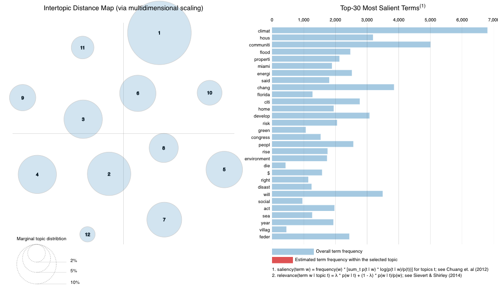

```{r setup, include=FALSE}
knitr::opts_chunk$set(echo = TRUE)

# attached packages
library(tidyr) #text analysis in R
library(lubridate) # working with date data
library(tidyverse)
library(tidytext)
library(here)
library(LexisNexisTools) # Nexis Uni data wrangling
library(sentimentr)
library(readr)
library(quanteda)
library(quanteda.textstats)
library(quanteda.textplots)
library(readtext) # quanteda subpackage for reading pdf
library(tm)
library(topicmodels)
library(ldatuning)
library(reshape2)
library(ggplot2)
library(forcats)
library(stringr)
library(widyr)# pairwise correlations
library(igraph) # network plots
library(ggraph)
library(patchwork)
library(wordcloud) # visualization of common words in the data set
library(rtweet) # load twitter library - the rtweet library is recommended now over twitteR
```

# Sentiment & Temporal Plan

- look at all nrc emotions 
- dial down into one or two emotions 
- temporal sentiments: specific emotions and neg/pos/neutral


- plot frequencies of both to compare social media frequency vs academic/published journal frequency 

- word relationship using geom_node and geom_edge ("scary plots")
- correlations
- hashtag word cloud

# Setup Data

### Setup stop words and Bing/NRC sentiments
```{r}
#read in stop words data
data(stop_words)
```

## Read in Nexis Uni Data
```{r}
# read in nexis uni data 
my_files <- list.files(pattern = ".docx", path = here("data"),
                      full.names = TRUE, recursive = TRUE, ignore.case = TRUE)

cg_nex_data <- lnt_read(my_files) # object of class 'LNT output'


cg_nex_meta_df <- cg_nex_data@meta
cg_nex_articles_df <- cg_nex_data@articles
cg_nex_paragraphs_df <- cg_nex_data@paragraphs
```

## Cleaning Nexis Uni Data
```{r nexis_data cloud seeding cleaning, message=FALSE}
cg_nex_dat2<- data_frame(element_id = seq(1:length(cg_nex_meta_df$Headline)),
                     Date = cg_nex_meta_df$Date,
                     Headline = cg_nex_meta_df$Headline)


cg_nex_paragraphs_dat <- data_frame(element_id = cg_nex_paragraphs_df$Art_ID,
                                Text  = cg_nex_paragraphs_df$Paragraph)

cg_nex_dat3 <- inner_join(cg_nex_dat2, cg_nex_paragraphs_dat, by = "element_id") %>%
  janitor::clean_names()

cg_nex_dat3 <- subset(cg_nex_dat3, text != " " )
cg_nex_dat3 <- cg_nex_dat3[!grepl("POSTED", cg_nex_dat3$text,ignore.case = TRUE),]
cg_nex_dat3 <- cg_nex_dat3[!grepl("GRAPHIC", cg_nex_dat3$text,ignore.case = TRUE),]
cg_nex_dat3 <- cg_nex_dat3[!grepl(":", cg_nex_dat3$text),]
cg_nex_dat3 <- cg_nex_dat3[!grepl("LINK TO", cg_nex_dat3$text,ignore.case = TRUE),]
cg_nex_dat3 <- cg_nex_dat3[grepl("[a-zA-Z]", cg_nex_dat3$text),]

# clean the corpus
cg_corp <- corpus(x = cg_articles_df, text_field = "Article")
cg_corp.stats <- summary(cg_corp)
head(cg_corp.stats, n = 25)
toks <- tokens(cg_corp, remove_punct = TRUE, remove_numbers = TRUE)
# added some project-specific stop words here
more_stops <- c(stopwords("en"), "like", "just", "say", "year")
add_stops<- tibble(word = c(stop_words$word, more_stops)) 
stop_vec <- as_vector(add_stops)
toks1 <- tokens_select(toks, pattern = add_stops, selection = "remove")

```

### Convert Nexis Uni to document-feature matrix
```{r dfm}
dfm_comm<- dfm(toks1, tolower = TRUE)
dfm <- dfm_wordstem(dfm_comm)
dfm <- dfm_trim(dfm, min_docfreq = 2) #remove terms only appearing in one doc (min_termfreq = 10)

print(head(dfm))

#remove rows (docs) with all zeros
sel_idx <- slam::row_sums(dfm) > 0 
dfm <- dfm[sel_idx, ]
```

## Read in Twitter Data
```{r}
raw_tweets <- readxl::read_excel(here("data","twitter_data_agg.xlsx"),sheet = 1, col_names = TRUE, col_types = 'text', na = "",skip=6)

dat <- raw_tweets[,c(4,6)] # Extract Date and Title fields

tweets <- tibble(text = dat$Title,
                 id = seq(1:length(dat$Title)),
                 date = as.Date(as.numeric(dat$Date), origin = "1899-12-30"))
```

### Cleaning Twitter Data
```{r create_corpus}
cg_t_corpus <- corpus(dat$Title) # enter quanteda
#summary(corpus)

cg_t_tokens <- tokens(cg_t_corpus) # tokenize the text so each doc (page, in this case) is a list of tokens (words)

# clean it up
cg_t_tokens <- tokens(cg_t_tokens, remove_punct = TRUE,
                 remove_numbers = TRUE)

cg_t_tokens <- tokens_select(cg_t_tokens, stopwords('english'), selection='remove') # stopwords lexicon built in to quanteda

# tokens <- tokens_wordstem(tokens) #stem words down to their base form for comparisons across tense and quantity

cg_t_tokens <- tokens_tolower(cg_t_tokens)


theString <- unlist(strsplit(tweets$text, " "))
regex <- "(^|[^@\\w])@(\\w{1,15})\\b"
tweets$text <- gsub(regex, "", tweets$text)
# let's clean up the URLs from the tweets
tweets$text <- gsub("http[^[:space:]]*", "",tweets$text)
tweets$text <- str_to_lower(tweets$text)
tokenized_tweets <- tweets %>%
  unnest_tokens(word, text)
```

### Initial exploration of twitter data-cleaned corpus
```{r}
# simple plot of tweets per day
tweets %>%
  count(date) %>%
  ggplot(aes(x = date, y = n))+
  geom_line()
```

We can use the kwic function (keywords-in-context) to briefly examine the context in which certain words or patterns appear.
```{r initial_analysis}
head(kwic(cg_t_tokens, pattern = phrase("climate gentrification"), window = 5))
```


# Analysis

## Sentiment Analysis

### Get Bing and NRC sentiments
```{r}
bing_sent <- get_sentiments('bing') # grab the bing sentiment lexicon from tidytext
# head(bing_sent, n = 20)
nrc_sent <- get_sentiments('nrc') %>% 
            filter(!sentiment %in% c("positive","negative")) # requires downloading a large dataset via prompt
```

### Nexis Uni Sentiment
#### Add Bing sentiments
```{r}
# unnest to word-level tokens, remove stop words, and join sentiment words
cg_nex_text_words <- cg_nex_dat3  %>% 
  unnest_tokens(output = word, input = text, token = 'words')
 
cg_nex_sent_words <- cg_nex_text_words %>% # break text into individual words
  anti_join(stop_words, by = 'word') %>% # returns only the rows without stop words
  inner_join(bing_sent, by = 'word') # joins and retains only sentiment words
```

#### Add NRC fear sentiments
```{r}
cg_nex_word_counts <- cg_nex_text_words %>%
  inner_join(nrc_sent) %>%
  count(word, sentiment, sort = TRUE) %>%
  ungroup()
```

#### Trends in Nexis Uni Data sentiment over time
```{r}
cg_nex_sent_counts <- cg_nex_text_words %>%
        inner_join(nrc_sent) %>%
        group_by(date) %>%
        count(sentiment, sort = TRUE) %>%
        mutate(sentwords_per_day = sum(n)) %>%
        mutate(pct_contribution = ((n/sentwords_per_day)*100))

cg_nex_sent_counts %>%
  group_by(date) %>%
  ggplot(aes(date, pct_contribution, group=sentiment, color=sentiment))  +
  geom_smooth( method="lm", se=F)  +
  labs(x = "Date",
       y = "Contribution to sentiment(%)",
       title = "NEXIS UNI-Trendlines of % Contribution to Overall Sentiment")
```

### Twitter Sentiment
```{r}
# tokenize tweets to individual words
words <- tweets %>%
  select(id, date, text) %>%
  unnest_tokens(output = word,
                input = text,
                token = "words") %>%
  anti_join(stop_words, by = "word") %>%
  left_join(bing_sent, by = "word") %>%
  left_join(tribble(~ sentiment, ~ sent_score,
                    "positive", 1,
                    "negative",-1),
            by = "sentiment")
```

#### Trends in Twitter sentiment over time
```{r}
cg_nex_sent_counts <- cg_nex_text_words %>%
        inner_join(nrc_sent) %>%
        group_by(date) %>%
        count(sentiment, sort = TRUE) %>%
        mutate(sentwords_per_day = sum(n)) %>%
        mutate(pct_contribution = ((n/sentwords_per_day)*100))

cg_nex_sent_counts %>%
  group_by(date) %>%
  ggplot(aes(date, pct_contribution, group=sentiment, color=sentiment))  +
  geom_smooth( method="lm", se=F)  +
  labs(x = "Date",
       y = "Contribution to sentiment(%)",
       title = "NEXIS UNI-Trendlines of % Contribution to Overall Sentiment")
```


#### Calculate Sentiments and plot 
```{r sentiment_calculations}
# take average sentiment score by tweet
tweets_sent <- tweets %>%
  left_join(words %>%
              group_by(id) %>%
              summarize(sent_score = mean(sent_score, na.rm = T)),
            by = "id")

neutral <- length(which(tweets_sent$sent_score == 0))
positive <- length(which(tweets_sent$sent_score > 0))
negative <- length(which(tweets_sent$sent_score < 0))

Sentiment <- c("Positive", "Neutral", "Negative")
Count <- c(positive, neutral, negative)
output <- data.frame(Sentiment, Count)
output$Sentiment <- factor(output$Sentiment, levels = Sentiment)
ggplot(output, aes(x = Sentiment, y = Count)) +
  geom_bar(stat = "identity", aes(fill = Sentiment)) +
  scale_fill_manual("legend",
                    values = c(
                      "Positive" = "green",
                      "Neutral" = "black",
                      "Negative" = "red"
                    )) +
  ggtitle("Barplot of Sentiment in Climate Gentrification tweets")
```

#### Plot of Sentiment by day
```{r plot_sentiment_by_day}
# tally sentiment score per day
daily_sent <- tweets_sent %>%
  group_by(date) %>%
  summarize(sent_score = mean(sent_score, na.rm = T))

daily_sent %>%
  ggplot( aes(x = date, y = sent_score)) +
  geom_line() +
    labs(x = "Date",
    y = "Avg Sentiment Score",
    title = "Daily Tweet Sentiment",
    subtitle = "Climate Gentrification Tweets")
```

#### Word relationships / Correlations of words in Nexis Uni
```{r tidy}
# create objects to do finds correlations 
# convert to tidy format and apply my stop words
raw_text <- tidy(cg_nex_corp)

# distribution of most frequent words across documents
raw_words <- raw_text %>%
  unnest_tokens(word, text) %>%
  anti_join(add_stops, by = 'word') %>%
  count(word, sort = TRUE)

report_words <- raw_words
 
par_tokens <- unnest_tokens(raw_text, output = paragraphs, input = text, token = "paragraphs")

par_tokens <- par_tokens %>%
 mutate(par_id = 1:n())

par_words <- unnest_tokens(par_tokens, output = word, input = paragraphs, token = "words")
```

```{r co-occur_paragraphs}
# find words that occur close together in the nexis uni docs
word_pairs <- par_words %>% 
  pairwise_count(word, par_id, sort = TRUE, upper = FALSE) %>%
  anti_join(add_stops, by = c("item1" = "word")) %>%
  anti_join(add_stops, by = c("item2" = "word"))
```

```{r co-occur_plots}
# plot correlations
word_pairs %>%
  filter(n >= 200) %>%
  graph_from_data_frame() %>%
  ggraph(layout = "fr") +
  geom_edge_link(aes(edge_alpha = n, edge_width = n), edge_colour = "dodgerblue") +
  geom_node_point(size = 5) +
  geom_node_text(aes(label = name), repel = TRUE, 
                 point.padding = unit(0.2, "lines")) +
  theme_void()
```

```{r corr_paragraphs}
# plot correlations by paragraph
word_cors <- par_words %>%
  add_count(par_id) %>%
  filter(n >= 200) %>%
  select(-n) %>%
  pairwise_cor(word, par_id, sort = TRUE)

word_cors %>%
  filter(item1 %in% c("climate", "gentrification", "equity", "income")) %>%
  group_by(item1) %>%
  top_n(6) %>%
  ungroup() %>%
  mutate(item1 = as.factor(item1),
         name = reorder_within(item2, correlation, item1)) %>%
  ggplot(aes(y = name, x = correlation, fill = item1)) +
  geom_col(show.legend = FALSE) +
  facet_wrap( ~ item1, ncol = 2, scales = "free") +
  scale_y_reordered() +
  labs(
    y = NULL,
    x = NULL,
    title = "Correlations with key words",
    subtitle = "Climate gentrification NEXIS UNI"
  )

# let's zoom in on just one of our key terms
gent_cors <- word_cors %>%
  filter(item1 == "gentrification") %>%
  mutate(n = 1:n())
```

```{r corr_network}
# correlation network
justice_cors  %>%
  filter(n <= 50) %>%
  graph_from_data_frame() %>%
  ggraph(layout = "fr") +
  geom_edge_link(aes(edge_alpha = correlation, edge_width = correlation), edge_colour = "cyan4") +
  geom_node_point(size = 5) +
  geom_node_text(aes(label = name), repel = TRUE, 
                 point.padding = unit(0.2, "lines")) +
  theme_void()
```

#### ???
Now let's look at the tf-idf term we talked about. Remember, this statistic goes beyond simple frequency calculations within a document to control for overall commonality across documents
```{r}
report_tf_idf <- report_words %>%
  bind_tf_idf(word, year, n) %>% 
  select(-total) %>%
  arrange(desc(tf_idf))

report_tf_idf %>%
  group_by(year) %>%
  slice_max(tf_idf, n = 10) %>%
  ungroup() %>%
  filter(nchar(word) > 2)%>%
  ggplot(aes(tf_idf, fct_reorder(word, tf_idf), fill = year)) +
  geom_col(show.legend = FALSE) +
  facet_wrap(~year, ncol = 2, scales = "free") +
  labs(x = "tf-idf", y = NULL)
```


Now let's look at the tf-idf term we talked about. Remember, this statistic goes beyond simple frequency calculations within a document to control for overall commonality across documents

```{r}
report_tf_idf <- report_words %>%
  bind_tf_idf(word, year, n) %>% 
  select(-total) %>%
  arrange(desc(tf_idf))

report_tf_idf %>%
  group_by(year) %>%
  slice_max(tf_idf, n = 10) %>%
  ungroup() %>%
  filter(nchar(word) > 2)%>%
  ggplot(aes(tf_idf, fct_reorder(word, tf_idf), fill = year)) +
  geom_col(show.legend = FALSE) +
  facet_wrap(~year, ncol = 2, scales = "free") +
  labs(x = "tf-idf", y = NULL)
```

So that gives an idea which words are frequent and unique to certain documents.

Now let's switch gears to quanteda for some additional word relationship tools. We'll also get into some ways to assess the similarity of documents.

```{r quanteda_init}
tokens <- tokens(cg_nex_corp, remove_punct = TRUE)
toks1<- tokens_select(tokens, min_nchar = 3)
toks1 <- tokens_tolower(toks1)
toks1 <- tokens_remove(toks1, pattern = (stop_vec))
dfm <- dfm(toks1)

#first the basic frequency stat
tstat_freq <- textstat_frequency(dfm, n = 5, groups = year)
head(tstat_freq, 10)
```

Another useful word relationship concept is that of the n-gram, which essentially means tokenizing at the multi-word level

```{r convert_dfm}
toks2 <- tokens_ngrams(toks1, n=2)
dfm2 <- dfm(toks2)
dfm2 <- dfm_remove(dfm2, pattern = c(stop_vec))
freq_words2 <- textstat_frequency(dfm2, n=20)
freq_words2$token <- rep("bigram", 20)
freq_words2
#tokens1 <- tokens_select(tokens1,pattern = stopwords("en"), selection = "remove")
```

Now we can upgrade that by using all of the frequencies for each word in each document and calculating a chi-square to see which words occur significantly more or less within a particular target document

```{r}
keyness <- textstat_keyness(dfm, target = 1)
textplot_keyness(keyness)
```

And finally, we can run a hierarchical clustering algorithm to assess document similarity. This tends to be more informative when you are dealing with a larger number of documents, but we'll add it here for future reference.

```{r hierarch_clust}
dist <- as.dist(textstat_dist(dfm))
clust <- hclust(dist)
plot(clust, xlab = "Distance", ylab = NULL)
```

## 1.  Most frequent trigrams in the dataset

```{r}
toks3 <- tokens_ngrams(toks1, n=3)
dfm3 <- dfm(toks3)
dfm3 <- dfm_remove(dfm3, pattern = c(stop_vec))
freq_words3 <- textstat_frequency(dfm3, n=20)
freq_words3$token <- rep("trigram", 20)
freq_words2
freq_words3
#tokens1 <- tokens_select(tokens1,pattern = stopwords("en"), selection = "remove")
```


#### Wordcloud of hashtags
```{r explore_hashtags}
hash_tweets <- tokens(cg_t_corpus, remove_punct = TRUE) %>%
  tokens_keep(pattern = "#*")

dfm_hash <- dfm(hash_tweets)

tstat_freq <- textstat_frequency(dfm_hash, n = 100)
head(tstat_freq, 10)

# tidytext gives us tools to convert to tidy from non-tidy formats
hash_tib <- tidy(dfm_hash)

hash_tib %>%
  count(term) %>%
  with(wordcloud(term, n, max.words = 100))
```

#### Convert to document feature matrix using `quanteda` `textstat_polarity()`
```{r}
dfm <- dfm(tokens)

#topfeatures(dfm, 12)

dfm.sentiment <- dfm_lookup(dfm, dictionary = data_dictionary_LSD2015)

#head(textstat_polarity(tokens, data_dictionary_LSD2015, fun = sent_logit))
```

#### Compare top ten most common tweets per day
```{r}
words_by_date <- tokenized_tweets %>%
    anti_join(stop_words) %>%
    group_by(date) %>% 
    count(date, word)

top_words_by_date <- words_by_date %>% group_by(date) %>% top_n(n = 10, wt = n)
top_words_by_date[order(top_words_by_date$n, decreasing = TRUE),]
```

#### Positive-Negative Wordcloud of Tweets
```{r}
words %>%
  inner_join(get_sentiments("bing")) %>%
  count(word, sentiment, sort = TRUE) %>%
  acast(word ~ sentiment, value.var = "n", fill = 0) %>%
  comparison.cloud(colors = c("red", "green"),
                   max.words = 100)
```

#### Most tagged accounts on Twitter
```{r}
at_tweets <- tokens(cg_t_corpus, remove_punct = TRUE) %>% 
               tokens_keep(pattern = "@*")

dfm_at<- dfm(at_tweets)

tstat_freq <- textstat_frequency(dfm_at, n = 10)

tstat_freq 
```

#### Calculated our own sentiment scores (positive, negative, neutral) for tweets and compared with the brandwatch sentiment scores
```{r}
# take average sentiment score by tweet
tweets_sent <- tweets %>%
  left_join(words %>%
              group_by(id) %>%
              summarize(sent_score = mean(sent_score, na.rm = T)),
            by = "id")

neutral <- length(which(tweets_sent$sent_score == 0))
positive <- length(which(tweets_sent$sent_score > 0))
negative <- length(which(tweets_sent$sent_score < 0))

b_neutral <- length(which(raw_tweets$Sentiment == "neutral"))
b_positive <- length(which(raw_tweets$Sentiment == "positive"))
b_negative <- length(which(raw_tweets$Sentiment == "negative"))


Sentiment <- c("Positive", "Neutral", "Negative")
Count_Computed <- c(positive, neutral, negative)
Count_Brandwatch <- c(b_positive, b_neutral, b_negative)
output <- data.frame(Sentiment, Count_Computed, Count_Brandwatch)
output$Sentiment <- factor(output$Sentiment, levels = Sentiment)
brandwatch <- ggplot(output, aes(x = Sentiment, y = Count_Brandwatch)) +
  geom_bar(stat = "identity", aes(fill = Sentiment)) +
  scale_fill_manual("legend",
                    values = c(
                      "Positive" = "green",
                      "Neutral" = "black",
                      "Negative" = "red"
                    )) +
  ggtitle("Barplot of Sentiment in Climate Gentrification tweets-Brandwatch Method")

computed <- ggplot(output, aes(x = Sentiment, y = Count_Computed)) +
  geom_bar(stat = "identity", aes(fill = Sentiment)) +
  scale_fill_manual("legend",
                    values = c(
                      "Positive" = "green",
                      "Neutral" = "black",
                      "Negative" = "red"
                    )) +
  ggtitle("Barplot of Sentiment in Climate Gentrification tweets-Computed")

brandwatch / computed
```


#### Miami and climate gentrification as multi-word term of interest
```{r}
MIA_cg <- c("Miami", "climate gentrification")
toks_inside <- tokens_keep(tokens, pattern = MIA_cg, window = 10)
toks_inside <- tokens_remove(toks_inside, pattern = MIA_cg) # remove the keywords
toks_outside <- tokens_remove(tokens, pattern = MIA_cg, window = 10)
```

```{r}
dfmat_inside <- dfm(toks_inside)
dfmat_outside <- dfm(toks_outside)

tstat_key_inside <- textstat_keyness(rbind(dfmat_inside, dfmat_outside), 
                                     target = seq_len(ndoc(dfmat_inside)))
head(tstat_key_inside, 25)
```

The tokens inside the 10-word window are the target while the tokens outside the 10-word window are the reference.


## Spatial Analysis

## Topic Modeling Analysis


### Optimization for k 
```{r LDA_again}
result <- FindTopicsNumber(
  dfm,
  topics = seq(from = 2, to = 20, by = 1),
  metrics = c("CaoJuan2009",  "Deveaud2014"),
  method = "Gibbs",
  control = list(seed = 77),
  verbose = TRUE
)

FindTopicsNumber_plot(result)
```

**FindTopicsNumber: 4, 7, 12**
k=5: 75%/30%
k=7: 55%/50%
k=12: 90%/25%

### Topic models for k=5, k=7 and k=12
```{r LDA_modeling_5}
k <- 5

topicModel_k5 <- LDA(dfm, k, method="Gibbs", control=list(iter = 500, verbose = 25))
#nTerms(dfm_comm) 

tmResult_5 <- posterior(topicModel_k5)
attributes(tmResult_5)
#nTerms(dfm_comm)   
beta_5 <- tmResult_5$terms   # get beta from results
dim(beta_5)                # K distributions over nTerms(DTM) terms# lengthOfVocab
terms(topicModel_k5, 10)
```

```{r LDA_modeling_7}
k <- 7 

topicModel_k7 <- LDA(dfm, k, method="Gibbs", control=list(iter = 500, verbose = 25))
#nTerms(dfm_comm) 

tmResult_7 <- posterior(topicModel_k7)
attributes(tmResult_7)
#nTerms(dfm_comm)   
beta_7 <- tmResult_7$terms   # get beta from results
dim(beta_7)                # K distributions over nTerms(DTM) terms# lengthOfVocab
terms(topicModel_k7, 10)
```

```{r LDA_modeling_12}
k <- 12

topicModel_k12 <- LDA(dfm, 12, method="Gibbs", control=list(iter = 500, verbose = 25))

tmResult_12 <- posterior(topicModel_k12)
terms(topicModel_k12, 10)
theta_12 <- tmResult_12$topics
beta_12 <- tmResult_12$terms
vocab <- (colnames(beta_12))
```

### Top words per topic
```{r top_terms_topic}
comment_topics_5 <- tidy(topicModel_k5, matrix = "beta")

comment_topics_7 <- tidy(topicModel_k7, matrix = "beta")

comment_topics_12 <- tidy(topicModel_k12, matrix = "beta")

top_terms_5 <- comment_topics_5 %>%
  group_by(topic) %>%
  top_n(10, beta) %>%
  ungroup() %>%
  arrange(topic, -beta)

top_terms_7 <- comment_topics_7 %>%
  group_by(topic) %>%
  top_n(10, beta) %>%
  ungroup() %>%
  arrange(topic, -beta)

top_terms_12 <- comment_topics_12 %>%
  group_by(topic) %>%
  top_n(10, beta) %>%
  ungroup() %>%
  arrange(topic, -beta)
```

### Plots of top terms per topics
```{r plot_top_terms, fig.width = 12, fig.height = 18}

top_terms_5_plot <- top_terms_5 %>%
  mutate(term = reorder(term, beta)) %>%
  ggplot(aes(term, beta, fill = factor(topic))) +
  geom_col(show.legend = FALSE) +
  facet_wrap(~ topic, scales = "free") +
  coord_flip() +
  labs(title="Top Terms for 5-Topic Model")

top_terms_7_plot <- top_terms_7 %>%
  mutate(term = reorder(term, beta)) %>%
  ggplot(aes(term, beta, fill = factor(topic))) +
  geom_col(show.legend = FALSE) +
  facet_wrap(~ topic, scales = "free") +
  coord_flip() +
  labs(title="Top Terms for 7-Topic Model")


top_terms_12_plot <- top_terms_12 %>%
  mutate(term = reorder(term, beta)) %>%
  ggplot(aes(term, beta, fill = factor(topic))) +
  geom_col(show.legend = FALSE) +
  facet_wrap(~ topic, scales = "free") +
  coord_flip()+
  labs(title="Top Terms for 12-Topic Model")


top_terms_5_plot / top_terms_7_plot / top_terms_12_plot
```

### Top 5 terms per topic 
```{r topic_names}
top5termsPerTopic_5 <- terms(topicModel_k5, 5)
topicNames_5 <- apply(top5termsPerTopic_5, 2, paste, collapse=" ")
topicNames_5

top5termsPerTopic_7 <- terms(topicModel_k7, 5)
topicNames_7 <- apply(top5termsPerTopic_7, 2, paste, collapse=" ")
topicNames_7


top5termsPerTopic_12 <- terms(topicModel_k12, 5)
topicNames_12 <- apply(top5termsPerTopic_12, 2, paste, collapse=" ")
topicNames_12
```


### Topic Modeling Intertopic Distance Maps
```{r LDAvis_5, results='hide', eval=FALSE}
# k=5
library(LDAvis)
library("tsne")
svd_tsne <- function(x) tsne(svd(x)$u)
json <- createJSON(
  phi = tmResult_5$terms, 
  theta = tmResult_5$topics, 
  doc.length = rowSums(dfm), 
  vocab = colnames(dfm), 
  term.frequency = colSums(dfm),
  mds.method = svd_tsne,
  plot.opts = list(xlab="", ylab="")
)
serVis(json)
```


```{r LDAvis_7, results='hide', eval=FALSE}
# k=7
library(LDAvis)
library("tsne")
svd_tsne <- function(x) tsne(svd(x)$u)
json <- createJSON(
  phi = tmResult_7$terms, 
  theta = tmResult_7$topics, 
  doc.length = rowSums(dfm), 
  vocab = colnames(dfm), 
  term.frequency = colSums(dfm),
  mds.method = svd_tsne,
  plot.opts = list(xlab="", ylab="")
)
serVis(json)
```


```{r LDAvis_12, results='hide', eval=FALSE}
# k=12
library(LDAvis)
library("tsne")
svd_tsne <- function(x) tsne(svd(x)$u)
json <- createJSON(
  phi = tmResult_12$terms, 
  theta = tmResult_12$topics, 
  doc.length = rowSums(dfm), 
  vocab = colnames(dfm), 
  term.frequency = colSums(dfm),
  mds.method = svd_tsne,
  plot.opts = list(xlab="", ylab="")
)
serVis(json)
```



# Results

# Next Steps

