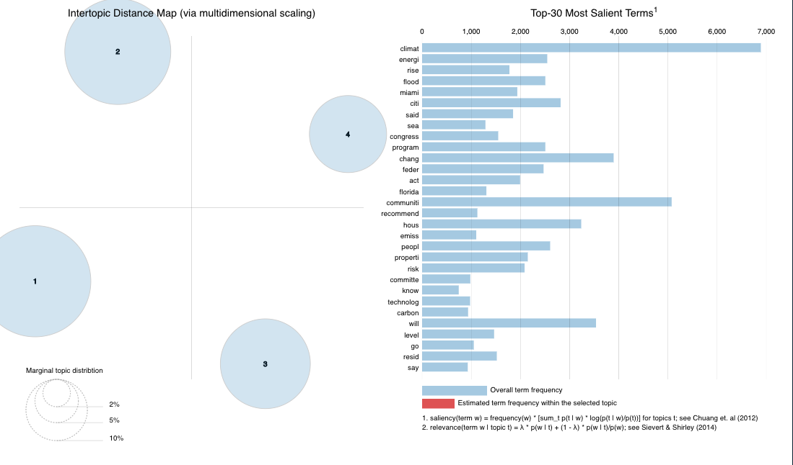
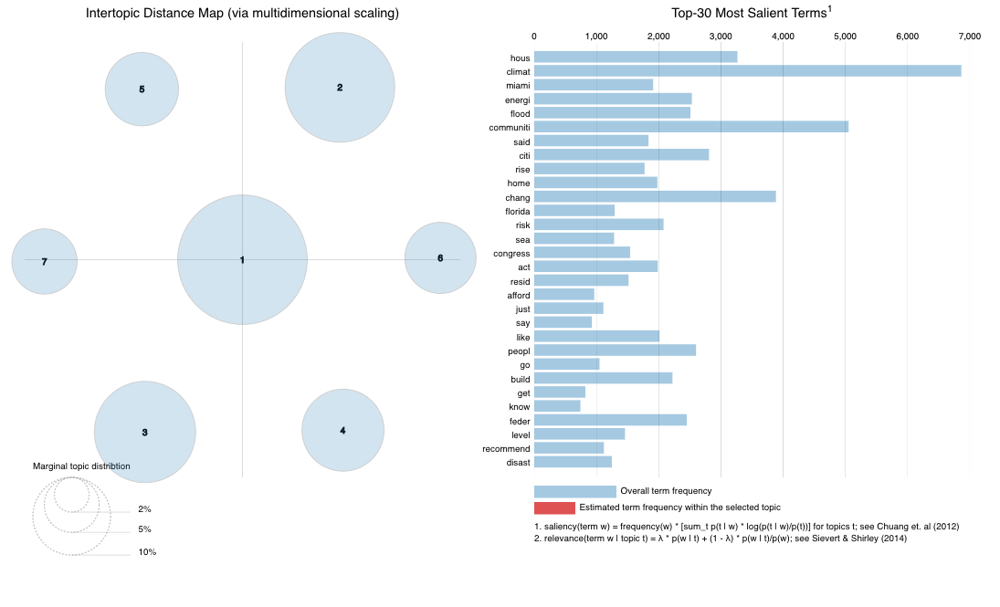
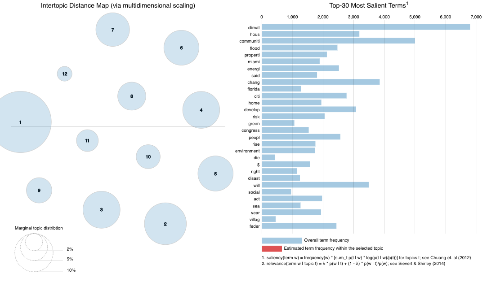

# Assignment:

Use the data you plan to use for your final project:

**Prepare the data so that it can be analyzed in the topicmodels package**

**Run three more models and select the overall best value for k (the number of topics) - include some justification for your selection: theory, FindTopicsNumber() optimization metrics, interpretability, LDAvis**


```{r setup, include=FALSE}
knitr::opts_chunk$set(echo = TRUE, warning = FALSE)
library(here)
library(pdftools)
library(quanteda)
library(tm)
library(topicmodels)
library(ldatuning)
library(tidyverse)
library(tidytext)
library(reshape2)
library(tidyr) #text analysis in R
library(lubridate) #working with date data
library(readr)
library(readtext) #quanteda subpackage for reading pdf
library(quanteda.textstats)
library(quanteda.textplots)
library(ggplot2)
library(forcats)
library(stringr)
library(widyr)# pairwise correlations
library(igraph) #network plots
library(ggraph)
library(LexisNexisTools) #Nexis Uni data wrangling
library(sentimentr)
library(patchwork)
```

## Import Nexis Uni Data
Our data for the final project uses search results from Nexis Uni for the search term "climate gentrification". 
This table shows the distribution of the type of results. 

**Theory: Climate gentrification is a relatively new topic and may not have many subtopics because it is both new and already very specific. As a matter of fact, we believe it's likely to be considered a subtopic under environmental justice. Nonetheless, we would like to explore the the topic modeling related to our data to see any patterns that may emerge.**


```{r pdf_import, results=FALSE}

my_files <- list.files(pattern = ".docx", path = here("data"),
                      full.names = TRUE, recursive = TRUE, ignore.case = TRUE)

cg_data <- lnt_read(my_files) #Object of class 'LNT output'


cg_meta_df <- cg_data@meta
cg_articles_df <- cg_data@articles
cg_paragraphs_df <- cg_data@paragraphs

cg_data2<- data_frame(element_id = seq(1:length(cg_meta_df$Headline)), 
                            Date = cg_meta_df$Date, 
                            Headline = cg_meta_df$Headline)
```


## Clean the corpus

```{r corpus}
cg_corp <- corpus(x = cg_articles_df, text_field = "Article")
```


```{r}
cg_corp.stats <- summary(cg_corp)
head(cg_corp.stats, n = 25)
toks <- tokens(cg_corp, remove_punct = TRUE, remove_numbers = TRUE)
#I added some project-specific stop words here
add_stops <- c(stopwords("en"), "like", "just", "say", "year")
toks1 <- tokens_select(toks, pattern = add_stops, selection = "remove")

```

## Convert to a document-feature matrix

```{r dfm}
dfm_comm<- dfm(toks1, tolower = TRUE)
dfm <- dfm_wordstem(dfm_comm)
dfm <- dfm_trim(dfm, min_docfreq = 2) #remove terms only appearing in one doc (min_termfreq = 10)

print(head(dfm))

#remove rows (docs) with all zeros
sel_idx <- slam::row_sums(dfm) > 0 
dfm <- dfm[sel_idx, ]
```

### Optimization for k 

```{r LDA_again}
result <- FindTopicsNumber(
  dfm,
  topics = seq(from = 2, to = 20, by = 1),
  metrics = c("CaoJuan2009",  "Deveaud2014"),
  method = "Gibbs",
  control = list(seed = 77),
  verbose = TRUE
)

FindTopicsNumber_plot(result)
```

**FindTopicsNumber: 4, 7, 12**
k=4: 50%
k=7: 75%
k=12: Close to 100% 

**We ran 3 models based on the number of topics provided by the optimization metrics. We think that k=4, k=7 and k=12 are good values to test for the number of topics according the results from the CauJuan2009 and Devaud2014 metrics. In this case, we do recognize that k=18 may also seem like a good number to test but we opted for k=4 instead because of our prior knowledge that climate gentrification does not have that many subtopics.**

### Topic models for k=4, k=7 and k=12

```{r LDA_modeling_4}
k <- 4

topicModel_k4 <- LDA(dfm, k, method="Gibbs", control=list(iter = 500, verbose = 25))
#nTerms(dfm_comm) 

tmResult_4 <- posterior(topicModel_k4)
attributes(tmResult_4)
#nTerms(dfm_comm)   
beta_4 <- tmResult_4$terms   # get beta from results
dim(beta_4)                # K distributions over nTerms(DTM) terms# lengthOfVocab
terms(topicModel_k4, 10)
```


```{r LDA_modeling_7}
k <- 7 

topicModel_k7 <- LDA(dfm, k, method="Gibbs", control=list(iter = 500, verbose = 25))
#nTerms(dfm_comm) 

tmResult_7 <- posterior(topicModel_k7)
attributes(tmResult_7)
#nTerms(dfm_comm)   
beta_7 <- tmResult_7$terms   # get beta from results
dim(beta_7)                # K distributions over nTerms(DTM) terms# lengthOfVocab
terms(topicModel_k7, 10)
```


```{r LDA_modeling_12}
k <- 12

topicModel_k12 <- LDA(dfm, 12, method="Gibbs", control=list(iter = 500, verbose = 25))

tmResult_12 <- posterior(topicModel_k12)
terms(topicModel_k12, 10)
theta_12 <- tmResult_12$topics
beta_12 <- tmResult_12$terms
vocab <- (colnames(beta_12))
```


```{r top_terms_topic}
comment_topics_4 <- tidy(topicModel_k4, matrix = "beta")

comment_topics_7 <- tidy(topicModel_k7, matrix = "beta")


comment_topics_12 <- tidy(topicModel_k12, matrix = "beta")

top_terms_4 <- comment_topics_4 %>%
  group_by(topic) %>%
  top_n(10, beta) %>%
  ungroup() %>%
  arrange(topic, -beta)


top_terms_7 <- comment_topics_7 %>%
  group_by(topic) %>%
  top_n(10, beta) %>%
  ungroup() %>%
  arrange(topic, -beta)


top_terms_12 <- comment_topics_12 %>%
  group_by(topic) %>%
  top_n(10, beta) %>%
  ungroup() %>%
  arrange(topic, -beta)


```

```{r plot_top_terms, fig.width = 12, fig.height = 18}

top_terms_4_plot <- top_terms_4 %>%
  mutate(term = reorder(term, beta)) %>%
  ggplot(aes(term, beta, fill = factor(topic))) +
  geom_col(show.legend = FALSE) +
  facet_wrap(~ topic, scales = "free") +
  coord_flip() +
  labs(title="Top Terms for 4-Topic Model")

top_terms_7_plot <- top_terms_7 %>%
  mutate(term = reorder(term, beta)) %>%
  ggplot(aes(term, beta, fill = factor(topic))) +
  geom_col(show.legend = FALSE) +
  facet_wrap(~ topic, scales = "free") +
  coord_flip() +
  labs(title="Top Terms for 7-Topic Model")


top_terms_12_plot <- top_terms_12 %>%
  mutate(term = reorder(term, beta)) %>%
  ggplot(aes(term, beta, fill = factor(topic))) +
  geom_col(show.legend = FALSE) +
  facet_wrap(~ topic, scales = "free") +
  coord_flip()+
  labs(title="Top Terms for 12-Topic Model")


top_terms_4_plot / top_terms_7_plot / top_terms_12_plot
```


```{r topic_names}
top5termsPerTopic_4 <- terms(topicModel_k4, 5)
topicNames_4 <- apply(top5termsPerTopic_4, 2, paste, collapse=" ")
topicNames_4

top5termsPerTopic_7 <- terms(topicModel_k7, 5)
topicNames_7 <- apply(top5termsPerTopic_7, 2, paste, collapse=" ")
topicNames_7


top5termsPerTopic_12 <- terms(topicModel_k12, 5)
topicNames_12 <- apply(top5termsPerTopic_12, 2, paste, collapse=" ")
topicNames_12
```


```{r LDAvis_4, results='hide'}
library(LDAvis)
library("tsne")
svd_tsne <- function(x) tsne(svd(x)$u)
json <- createJSON(
  phi = tmResult_4$terms, 
  theta = tmResult_4$topics, 
  doc.length = rowSums(dfm), 
  vocab = colnames(dfm), 
  term.frequency = colSums(dfm),
  mds.method = svd_tsne,
  plot.opts = list(xlab="", ylab="")
)
serVis(json)

```



```{r LDAvis_7, results='hide'}
library(LDAvis)
library("tsne")
svd_tsne <- function(x) tsne(svd(x)$u)
json <- createJSON(
  phi = tmResult_7$terms, 
  theta = tmResult_7$topics, 
  doc.length = rowSums(dfm), 
  vocab = colnames(dfm), 
  term.frequency = colSums(dfm),
  mds.method = svd_tsne,
  plot.opts = list(xlab="", ylab="")
)
serVis(json)

```


```{r LDAvis_12, results='hide'}
library(LDAvis)
library("tsne")
svd_tsne <- function(x) tsne(svd(x)$u)
json <- createJSON(
  phi = tmResult_12$terms, 
  theta = tmResult_12$topics, 
  doc.length = rowSums(dfm), 
  vocab = colnames(dfm), 
  term.frequency = colSums(dfm),
  mds.method = svd_tsne,
  plot.opts = list(xlab="", ylab="")
)
serVis(json)

```

The interopic distance maps show that there's not much overlap either of the three topic models.
Given our limited dataset, there were alot of small topics in k=12 model that may not be important to the overarching themes of climate gentrification
We found the interpretation for 12 was not useful because it parsed out topics more than necessary (i.e. flood and rise were in two different topics).
The k=4 model has a good spread in the intertopic distance map but it only scored 50% on the optimization metrics. 
The k=7 model has good spread in the intertopic distance map as well but there seems to be one very large topic in the center of it all.
Since the k=7 model scored nearly 75% on the optimization metric, we believe that the optimal number of topics is 7 as strikes a good balance between detail of the topics and usefulness.
However, as mentioned earlier, the newness and specificity of our search term does not make it well suited for topic modelling analysis.


